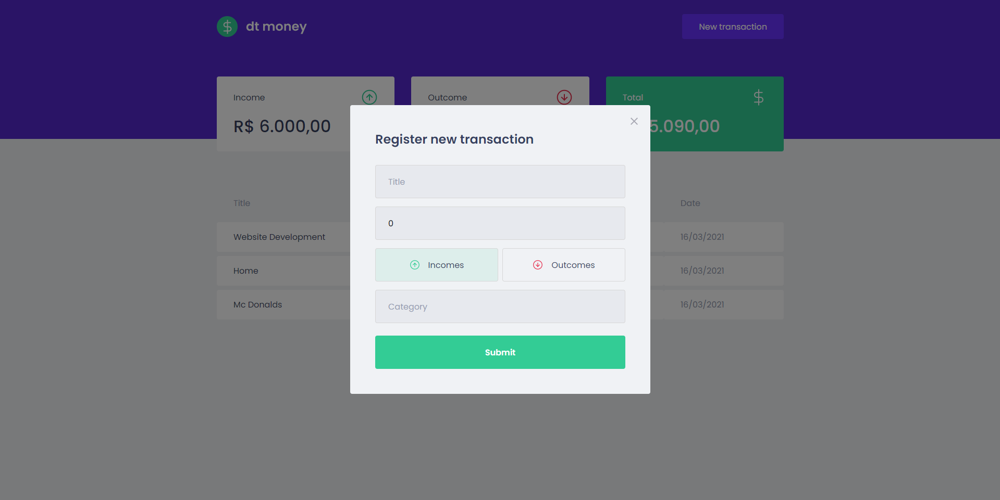

<h2 align="center">
  
  
  
</h2>


<p align="center">
   
</p>

#### ✅ Aplicação Finalizada!
|        Etapas         |
|-----------------------|
|Estrura da aplicação ✅| 
|Componentização      ✅| 
|Consumindo API       ✅|
|Modal & Forms        ✅|
|Sexta                ✅|

## 📖 Sobre 

O dtmoney foi desenvolvido para ter uma educação financeira melhor, sendo possível registrar o nosso fluxo de caixa mensal. 

O projeto foi desenvolvido durante o Ignite sendo elaborado pela Instituição educacional [Rocketseat](https://github.com/Rocketseat).


<div align="center">
   <sub>Desenvolvido por 
    <a href="https://github.com/ArthurHMES">Arthur Eller</a>, sobre o auxílio do instrutor 
    <a href="https://github.com/diego3g">Diego Fernandes.</a>
  </sub>
</div>

## :pushpin: Tabela de Conteúdo

* [Tecnologias](#computer-tecnologias)
* [Funcionalidades](#rocket-funcionalidades)
* [Rodando projeto na sua máquina](#construction_worker-como-rodar)

* [Licença](#memo-licença)

### Layout
Preview da aplicação

|  |  |
|----------|----------|
|  |   |


## :computer: Tecnologias
Durante o projeto ultilizei as seguintes tecnologias:

* [Typescript](https://www.typescriptlang.org/)
* [React](https://reactjs.org/)
* [React Context API](https://pt-br.reactjs.org/docs/context.html)
* [Styled Components](https://styled-components.com/)


# :construction_worker: Como rodar

```bash
# Clone o Repositorio
$ git clone https://github.com/ArthurHMES/dtmoney.git

```
### 💻 Inicializando o projeto!

```bash
# Instale as depedencias
$ yarn install

# Rode a aplicação
$ yarn dev

```
Acesse: http://localhost:3000/ para ver o resultado

### 🌐 Netlify 
Acesse: https://dtmoney.netlify.app/

# :memo: Licença

Lançado em 2021 :memo: Licença
Esse projeto esta sobre [MIT license](./LICENSE).

<h4 align="center">
    Feito com 💜 by <a href="https://www.linkedin.com/in/arthur-eller/" target="_blank">Arthur Eller </a>
</h4>